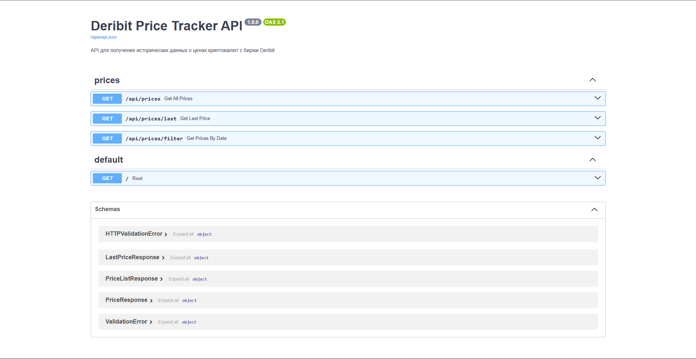
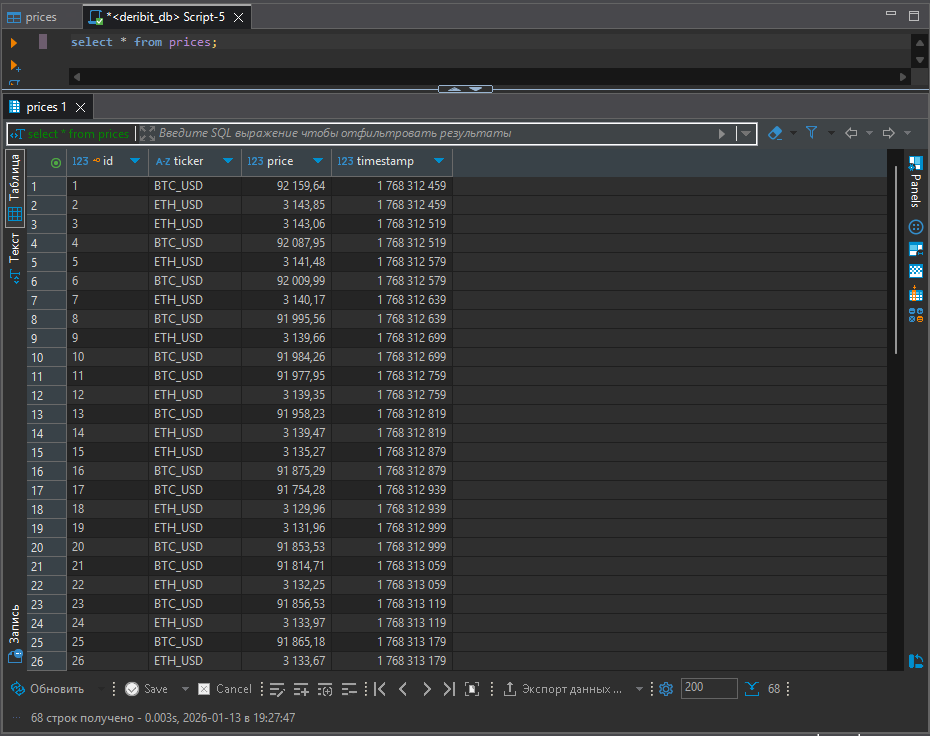
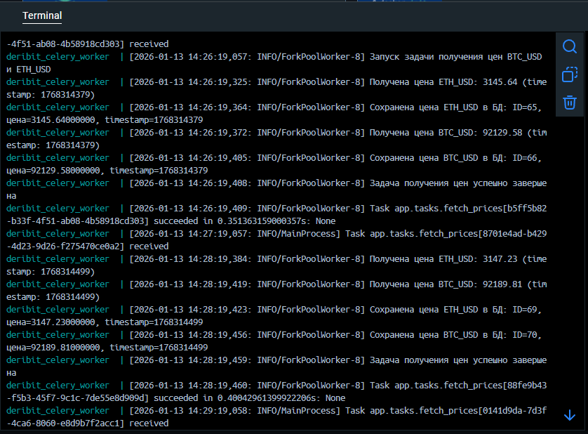

# Deribit Price Tracker

Система для отслеживания цен криптовалют с биржи Deribit и предоставления API для доступа к историческим данным.

## Описание

Приложение состоит из двух основных компонентов:
1. **Celery Worker** - периодически получает индексные цены BTC и ETH с биржи Deribit каждую минуту и сохраняет их в PostgreSQL
2. **FastAPI Application** - предоставляет REST API для получения сохраненных данных о ценах

## Технологический стек

- **FastAPI** - веб-фреймворк для API
- **PostgreSQL** - реляционная база данных
- **Celery** - распределенная система задач
- **Redis** - брокер сообщений для Celery
- **SQLAlchemy** - ORM для работы с БД
- **aiohttp** - асинхронный HTTP клиент
- **Docker** - контейнеризация приложения

## Требования

- Docker и Docker Compose
- Python 3.11+ (для локальной разработки)

## Быстрое развертывание

### 1. Клонирование репозитория

```bash
git clone <repository-url>
cd deribit-price-tracker
```

### 2. Создание файла .env

Скопируйте `.env.example` в `.env`:

**Windows PowerShell:**
```powershell
Copy-Item .env.example .env
```

**Linux/Mac:**
```bash
cp .env.example .env
```

Или создайте файл `.env` вручную:
```env
POSTGRES_USER=deribit_user
POSTGRES_PASSWORD=deribit_password
POSTGRES_DB=deribit_db
POSTGRES_HOST=localhost
POSTGRES_PORT=5432
REDIS_HOST=redis
REDIS_PORT=6379
CELERY_BROKER_URL=redis://redis:6379/0
CELERY_RESULT_BACKEND=redis://redis:6379/0
```

### 3. Запуск приложения

```bash
docker-compose up -d
```

### 4. Проверка статуса

```bash
docker-compose ps
```

Все контейнеры должны быть в статусе "Up".

### 5. Доступ к приложению

- **API**: http://localhost:8000
- **Документация Swagger**: http://localhost:8000/docs
- **Альтернативная документация**: http://localhost:8000/redoc

## Использование API

Все методы требуют обязательный query-параметр `ticker` (BTC или ETH). Допускаются также BTC_USD/ETH_USD.

### 1. Получение всех сохраненных данных по валюте

```bash
GET /api/prices?ticker=BTC
```

**Пример ответа:**
```json
{
  "prices": [
    {
      "id": 1,
      "ticker": "BTC",
      "price": "92084.62000000",
      "timestamp": 1768312459
    }
  ],
  "total": 1
}
```

### 2. Получение последней цены валюты

```bash
GET /api/prices/last?ticker=ETH
```

**Пример ответа:**
```json
{
  "ticker": "ETH",
  "price": "3143.85000000",
  "timestamp": 1768312459
}
```

### 3. Получение цены с фильтром по дате

```bash
GET /api/prices/filter?ticker=BTC&start_date=2024-01-01&end_date=2024-01-31
```

**Параметры:**
- `ticker` (обязательный) - BTC или ETH (BTC_USD/ETH_USD тоже принимаются)
- `start_date` (опциональный) - начальная дата в формате YYYY-MM-DD
- `end_date` (опциональный) - конечная дата в формате YYYY-MM-DD

## Структура проекта

```
deribit-price-tracker/
├── app/
│   ├── __init__.py
│   ├── main.py                 # FastAPI приложение
│   ├── config.py               # Конфигурация
│   ├── database.py             # Подключение к БД
│   ├── models.py              # SQLAlchemy модели
│   ├── schemas.py             # Pydantic схемы
│   ├── services/
│   │   ├── __init__.py
│   │   ├── deribit_client.py  # Клиент Deribit (aiohttp)
│   │   └── price_service.py   # Сервис для работы с ценами
│   ├── api/
│   │   ├── __init__.py
│   │   └── routes.py           # API роуты
│   ├── celery_app.py          # Конфигурация Celery
│   └── tasks.py               # Celery задачи
├── alembic/                   # Миграции БД
├── tests/                     # Unit тесты
├── docker-compose.yml
├── Dockerfile
├── requirements.txt
└── README.md
```

## Полезные команды

### Управление контейнерами

```bash
# Просмотр логов
docker-compose logs -f

# Логи конкретного сервиса
docker-compose logs -f celery_worker
docker-compose logs -f app

# Остановка контейнеров
docker-compose stop

# Остановка и удаление
docker-compose down

# Пересборка и запуск
docker-compose up -d --build
```

### Работа с базой данных

```bash
# Подключение к PostgreSQL
docker-compose exec db psql -U deribit_user -d deribit_db

# Просмотр данных
docker-compose exec db psql -U deribit_user -d deribit_db -c "SELECT * FROM prices ORDER BY timestamp DESC LIMIT 10;"

# Очистка таблицы prices
docker-compose exec db psql -U deribit_user -d deribit_db -c "DELETE FROM prices;"
```

### Тестирование

```bash
# Запуск тестов
docker-compose exec app pytest tests/ -v

# Или локально
pytest tests/ -v
```

## Скриншоты

### API Документация

*Swagger документация доступна по адресу http://localhost:8000/docs*

### Данные в базе данных

*Пример данных из таблицы prices*

### Логи Celery Worker

*Логи успешного получения цен с биржи Deribit*

## Design Decisions

### Архитектура

1. **Разделение ответственности**: Приложение разделено на слои (API, Services, Models), что обеспечивает чистую архитектуру и упрощает тестирование.

2. **Использование Dependency Injection**: Конфигурация и зависимости передаются через конструкторы классов, что исключает использование глобальных переменных и упрощает тестирование.

3. **Асинхронность**: Использование `aiohttp` для клиента Deribit и `async/await` в FastAPI обеспечивает высокую производительность при работе с I/O операциями.

### База данных

1. **PostgreSQL**: Выбрана как надежная и производительная реляционная БД с поддержкой индексов для быстрого поиска по датам и тикерам.

2. **SQLAlchemy ORM**: Использование ORM упрощает работу с БД и обеспечивает миграции через Alembic.

3. **Индексы**: Созданы индексы на поля `ticker` и `timestamp` для оптимизации запросов по фильтрации.

### Периодические задачи

1. **Celery**: Выбран для выполнения периодических задач, так как это стандартное решение для Python приложений с поддержкой распределенных задач.

### Тикеры и нормализация

Внутренне приложение нормализует входящие тикеры к формату `BTC` и `ETH` для хранения в базе. API продолжает принимать как новый формат (`BTC`, `ETH`), так и legacy-формат (`BTC_USD`, `ETH_USD`) — они автоматически нормализуются. Это было сделано для упрощения запросов и унификации хранения.

2. **Redis как брокер**: Redis используется как брокер сообщений для Celery из-за простоты настройки и высокой производительности.

3. **Точное выполнение**: Используется `crontab(minute="*")` для запуска задачи каждую минуту в 0 секунд, что гарантирует интервал ровно 60 секунд между записями.

### API Design

1. **RESTful подход**: Использованы стандартные HTTP методы (GET) и понятные URL структуры.

2. **Обязательный параметр ticker**: Все методы требуют параметр `ticker` для обеспечения безопасности и валидации входных данных.

3. **Pydantic схемы**: Использованы для валидации входных и выходных данных API.

### Контейнеризация

1. **Docker Compose**: Использован для оркестрации контейнеров (приложение, БД, Redis, Celery), что упрощает развертывание и разработку.

2. **Отдельные контейнеры**: Приложение и база данных развернуты в отдельных контейнерах для соблюдения принципа разделения ответственности.

### Обработка ошибок

1. **Исключения**: Реализованы кастомные исключения для обработки ошибок клиента Deribit и валидации данных.

2. **HTTP статус коды**: Использованы правильные HTTP статус коды (404 для не найденных данных, 400 для ошибок валидации).

### Тестирование

1. **Unit тесты**: Написаны тесты для основных методов сервисов и API endpoints с использованием моков.

2. **Pytest**: Выбран как стандартный фреймворк для тестирования Python приложений.

## Решение проблем

### Контейнеры не запускаются

1. Проверьте логи: `docker-compose logs`
2. Убедитесь, что порты 8000, 5432, 6379 свободны
3. Пересоберите образы: `docker-compose build --no-cache && docker-compose up -d`

### База данных не инициализируется

```bash
docker-compose exec app alembic upgrade head
```

### Celery задачи не выполняются

1. Проверьте логи: `docker-compose logs celery_worker`
2. Проверьте Redis: `docker-compose exec redis redis-cli ping` (должен вернуть PONG)
3. Перезапустите worker: `docker-compose restart celery_worker celery_beat`

## Проверка работы

1. Откройте http://localhost:8000/docs
2. Выполните запрос: `GET /api/prices?ticker=BTC`
3. Подождите минуту и проверьте логи Celery: `docker-compose logs -f celery_worker`
4. Проверьте данные в БД: `docker-compose exec db psql -U deribit_user -d deribit_db -c "SELECT * FROM prices ORDER BY timestamp DESC LIMIT 5;"`

## Локальное развертывание (без Docker)

1. Установите зависимости: `pip install -r requirements.txt`
2. Настройте PostgreSQL и Redis (должны быть запущены локально)
3. Создайте файл `.env` с настройками подключения
4. Примените миграции: `alembic upgrade head`
5. Запустите Celery worker: `celery -A app.celery_app worker --loglevel=info`
6. Запустите Celery beat: `celery -A app.celery_app beat --loglevel=info`
7. Запустите FastAPI: `uvicorn app.main:app --reload`
